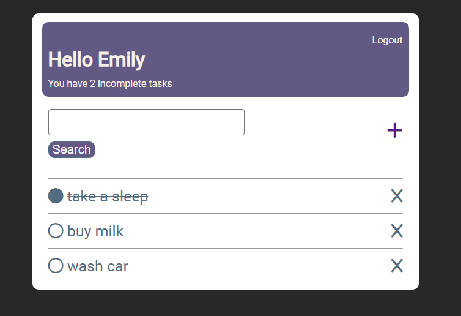

# Todo App

Simple todo app on django

# Screenshot
Here we have project screenshot :



### Use
```
$ git clone https://github.com/Icebeear/todo_app.git
$ cd todo_app
$ pip install -r requirements.txt
$ cd app/
$ ./manage.py migrate
$ ./manage.py runserver
```
